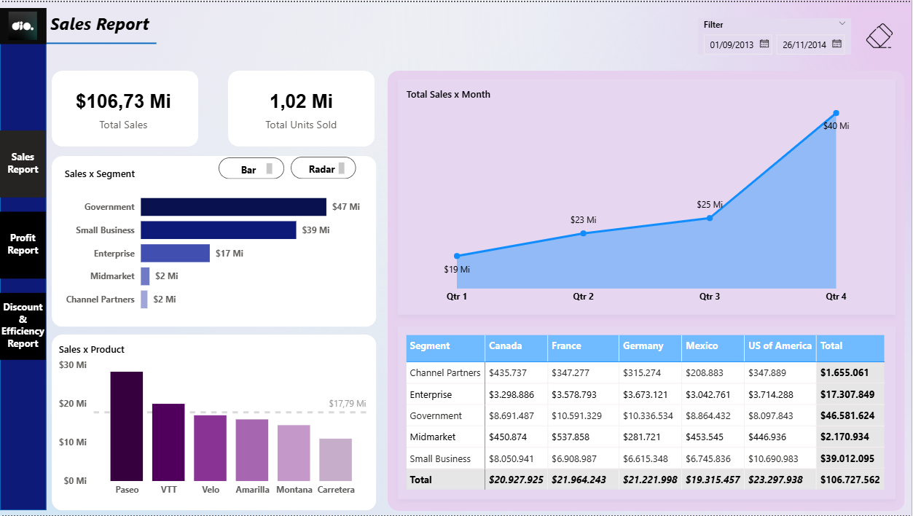
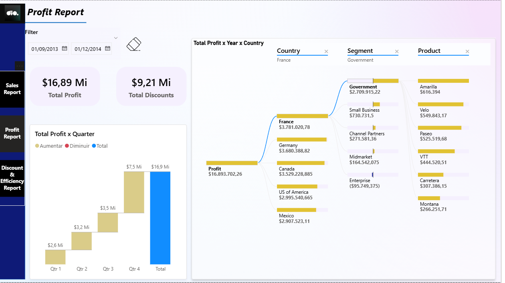

# Projeto: Relatório Financeiro 2.0 - Foco em UX e Design

Este projeto apresenta a evolução de um relatório financeiro desenvolvido no **Microsoft Power BI**. O foco principal desta etapa foi a **Experiência do Usuário (UX)** e a aplicação de princípios de **Design de Interfaces (UI)** para tornar a análise de dados mais intuitiva, agradável e eficiente.

O desafio consistiu em reformular o relatório original (baseado na *Financial Sample*), aplicando conceitos como contraste, alinhamento, proporção áurea e segmentação lógica.

## 🎨 Melhorias de Design e UX

Para atingir um padrão visual profissional, foram aplicadas as seguintes diretrizes:

* **Menu de Navegação Lateral:** Criação de um menu fixo e intuitivo no lado esquerdo, permitindo ao usuário transitar facilmente entre as 3 páginas do relatório (Sales, Profit, Discount).
* **Contraste e Identidade Visual:** Utilização de um fundo escuro para a barra de navegação em contraste com o "canvas" claro, destacando os dados. A paleta de cores (tons de roxo e azul) foi padronizada para manter a consistência.
* **Hierarquia Visual:** Os elementos foram posicionados estrategicamente:
    * **KPIs (Cartões):** No topo, para leitura imediata.
    * **Gráficos Principais:** Em destaque, respeitando a leitura em "Z" ou "F".
    * **Detalhamento:** Tabelas e matrizes posicionadas para consulta secundária.
* **Interatividade (Botões):** Configuração de estados nos botões de navegação (padrão, ao passar o mouse, selecionado) para fornecer feedback visual ao usuário.

---

## 📂 Estrutura do Relatório

O dashboard é composto por três páginas analíticas distintas:

### 1. Sales Report (Visão de Vendas)
Focada no volume de receita e tendências temporais.
* **Destaques:** Gráfico de área para evolução mensal e matriz detalhada cruzando segmentos e países.

### 2. Profit Report (Visão de Lucros)
Focada na decomposição do lucro para identificar ofensores e impulsionadores.
* **Destaques:**
    * **Árvore de Decomposição (Decomposition Tree):** Permite explorar o lucro hierarquicamente (País > Segmento > Produto).
    * **Gráfico de Cascata (Waterfall):** Essencial para visualizar o acúmulo de lucro por trimestre.

### 3. Discount & Efficiency (Novo!)
Uma página inédita criada para analisar a relação entre descontos concedidos e a margem de lucro.
* **Destaques:**
    * **Gráfico de Dispersão (Scatter Plot):** Relaciona *Vendas Totais* vs. *Lucro*, permitindo identificar outliers (segmentos com muita venda e pouco lucro).
    * **Análise de Margem:** Gráficos de barra mostrando a margem percentual por produto.
    * **Tabela de Eficiência:** Mostra a % de Desconto médio aplicado por país e segmento.

---

## 🛠️ Ferramentas e Técnicas
* **Microsoft Power BI:** Construção completa do dashboard.
* **UX Design:** Aplicação de princípios de *Gestalt* (proximidade e semelhança) para agrupar visuais relacionados.

